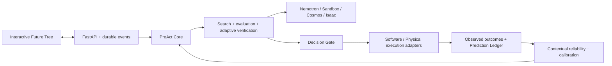

# PreAct

**A counterfactual runtime for agents: explore futures, verify consequential decisions,
act once, and calibrate trust from what actually happened.**

Software and Physical World share one domain-independent search, evaluation, gate,
event ledger and calibration implementation. The main interface is an interactive
Future Tree, with evidence, actual outcomes and prediction errors.

## Evidence and publication scope

This candidate has fresh public history; private development history is excluded.
Historical revision hashes in reports identify archived private executions, not public
Git ancestors. Public copies normalize machine paths with provenance notes. Source,
model/protocol identities, benchmark failures and artifact hashes retain their original
scope. Raw benchmark archives, credentials, local databases, model weights and private
footage are excluded; public summaries/calibration receipts and owned screenshots remain.
No live Nebius/Cosmos/Isaac GPU validation or public deployment is claimed.

## Run locally

Requirements: Python 3.12 (validated and selected by `.python-version`), uv, Node 22+
and npm. No API credentials are needed for the explicit local execution lab. It executes
bundled Python repair probes and real MuJoCo Cartesian manipulation; it does not claim
NVIDIA or hardware validation.

```bash
uv sync --python 3.12 --frozen --extra dev --extra physical --extra sandbox
npm --prefix web ci
npm --prefix web run build
uv run preact serve
```

Open http://127.0.0.1:8000. Run Software World, inspect the rejected shortcut and the
selected repair sequence, then run Physical World through the same tree renderer.
Select a branch to inspect evidence, change decision rounds, replay events, or compare
Direct Agent. Data persists in `.preact/`; restart halts interrupted runs for reconciliation.
For frontend development, run `npm --prefix web run dev` alongside the API.

```bash
uv run preact demo software
uv run preact demo physical
uv run preact demo software --task release
uv run preact demo software --direct
uv run preact doctor
uv run preact benchmark --seeds 5 --ablations
uv run preact benchmark --seeds 5 --ablations --workflows
```

## Verify

```bash
uv run ruff check src tests workers scripts
uv run ruff format --check src tests workers scripts
uv run pytest -q
npm --prefix web run build
npm --prefix web run contracts
npm --prefix web exec playwright install chromium
npm --prefix web run test:e2e
uv build --out-dir .cache/distributions
uv run python scripts/audit_distributions.py .cache/distributions --output .cache/distribution-audit.json
```

Browser tests launch a real local API and Chromium. Python tests run actual bundled
source and MuJoCo, including veto/abstention, multi-step trees, family disagreement,
error labels, aligned disagreement, trust drift, ordered replay, receipts, job leases
and cancellation before/during execution. Storage-aware health checks reject database outages.
Persistence runs off-loop and drains cancelled writes before reconciling receipts. The
distribution audit checks packaged source, setup/frontend assets and Apache licensing,
and rejects private caches, configuration, archive links and duplicate files. It refuses
an existing output file; use a new evidence path when repeating it. CI additionally builds
with a nested ignored-cache sentinel to guard the reproduced source-archive failure.
This checks archive integrity, not complete secret scanning or installed execution. The
[actual PostgreSQL proof](reports/postgres-storage-deadlines.json) records bounded lock
failure, responsive heartbeats and zero dispatch after a deadline; safe cleanup can outlast
the action budget. Run `scripts/verify_storage_deadlines.py` only with the separate
`preact_verification` database available, as described in its module documentation.
The local benchmark is deliberately narrow; it is not a held-out generalization result.
Raw episode events and manifest are generated under `reports/local-benchmark/`.

The separate [frozen local cohort protocol](benchmarks/README.md#frozen-local-cohorts)
uses disjoint development/calibration/held-out tasks and runs eight conditions over
24 held-out cases × five seeds per world. [Findings](reports/cohort-analysis.md) report
failures, abstentions, extra calls/latency and calibration limits. These are bounded
first-party program patches and Cartesian scene instances, with local heuristic proposals;
live equivalent-model sponsor benchmarks remain open.

Import an episode archive with `uv run preact replay path/to/episode.json` and, when needed,
`--artifact-source path/to/artifacts`. Imported history is labeled recorded replay and
does not execute actions or add calibration labels.

The local "Migration + release" task executes patch → constrained SQLite migration →
compatible configuration → bytecode build. It checks preserved orders, schema defaults/
constraints, validation and the release fingerprint. Arbitrary shell commands and generated
SQL cannot execute locally. Cloud mode provides this bounded workflow through ConTree
checkpoints and a protected standalone evaluator; live service validation remains pending.

## Nebius and NVIDIA

The optional [real local NVIDIA model mode](docs/local-model.md) runs the official
Nemotron 3 Nano 4B checkpoint on Apple Metal, with verified weight/conversion/runner hashes,
authenticated loopback access and the same Core/verifiers. Both worlds completed an actual
single-seed development comparison and the complete original 384-episode pilot;
earlier schema/ranking/deadline failures remain recorded. The
[pilot analysis](reports/cohort-model-pilot-analysis-v1.md) reports safety/completion
gains alongside substantial latency, poor physical risk forecasts and calibration
losses. The [completed five-seed comparison](reports/cohort-model-analysis-v2.md)
retains all 1,920 episodes, six Physical timeouts, ablation losses and worse selected
model calibration on previously exposed instances. Its complete audited private
bundle replays without new execution or calibration; it has not been published.
The [complete findings command](benchmarks/README.md#reproduce-complete-findings)
reproduces metrics, failures, paired intervals and engine scores from audited archives;
it requires a sealed cohort and preserves its original source/model identity.
[Repaired release validation](reports/proposal-repair-release-validation.json)
records clean-checkout, package, browser and local container checks.
[Current applied-source release validation](reports/defensive-release-validation.json)
records 330 independent-checkout tests and six passing browser cases on both fresh
SQLite and the rebuilt local PostgreSQL image, readable first actions and decision-scoped
trust evidence; unexecuted futures and earlier replay points receive no later update.
[Private actual-model footage proof](reports/local-model-defensive-footage.json)
records both safe shared-Core runs and a decoded 148.52-second edit with explicitly
compressed waiting; raw footage/events remain private. Public video and sponsor
acceptance are still open. This is local model inference, separate from the cloud
and GPU-simulator gates below.

Set server-side configuration using `.env.example` (never commit `.env`).
`PREACT_MODE=cloud` requires an exact available Nemotron model ID and Token Factory key.
Nemotron ranks candidates and predicts action postconditions; a stronger model can
supply additional reasoning. Real ConTree Sandbox executes independent software
verification and episode probes. Physical authority is a remote Isaac Franka worker;
Cosmos uses action-conditioned video generation on a separate Linux GPU environment.

Cloud mode never silently substitutes local success. These adapters have not passed
live cloud validation in this environment: credentials, beta admission, RTX/GPU workers
and service quota are absent. Isaac nominal evidence retains wide bounds and abstains
until sufficient perturbation verification is measured. A bounded strong perturbation
worker is implemented but has not executed on a GPU. Cosmos videos
retain unknown success/risk until applicability and visual extraction are validated.
[Integration setup and remaining gates](docs/integrations.md) details exact boundaries.
The Isaac launcher supplies a checksummed shared-source bridge to its Python 3.11 SDK;
sixteen CPU cross-interpreter checks pass. This is import validation, not NVIDIA execution.
Isaac reconstructs all declared geometry and records actual SDK/device provenance. Cosmos
requires aligned endpoint camera/tool/contact evidence for held transport; grasp/release
conditioning is unsupported. Timing/padding and native seed limitations remain explicit.

`uv run preact validate-token-factory --catalog-only --output .preact/catalog.json`
discovers admitted model IDs. After selecting an exact ID, omit `--catalog-only` and
choose a new evidence path to validate structured predictions for both world contracts.
Missing access fails explicitly. Server-owned API policy limits prevent client requests
from loosening safety thresholds or extending budgets; see [deployment](deploy/README.md).

## Architecture and status



`src/preact/core/` imports no domain/vendor libraries. Domain adapters own action
contracts and execution; engines normalize prediction evidence. SQLite supports local
use; SQLAlchemy PostgreSQL storage and leased worker jobs support deployment. Artifact
hashes verify local files or S3 objects. `web/` uses a single React Flow renderer.

The accepted [implementation plan](docs/implementation-plan.md) is the source of truth.
[Agent progress](docs/agent-progress.md) records evidence, failures and remaining work.
[Official hackathon requirements](docs/hackathon-requirements.md) and the
[acceptance checklist](docs/submission-checklist.md) govern release. Progressive widening,
stochastic outcomes and cloud model-generated patch contracts are implemented. Broader
repository workloads, live sponsor-model held-out evaluation and GPU acceptance remain incomplete;
local demonstration success does not pass those gates.

## License

Original PreAct code is Apache-2.0; see [LICENSE](LICENSE).
Third-party SDKs, simulator assets and model checkpoints retain their own terms.
See [third-party inventory](docs/third-party.md). This repository has not yet been
published or submitted to Devpost.

Fresh staged installation, regression, browser, package, CPU bridge and local-cohort
checks are recorded in [public candidate validation](reports/public-release-validation.json). These checks
do not close live sponsor, GPU, hosting, publication or submission gates.
