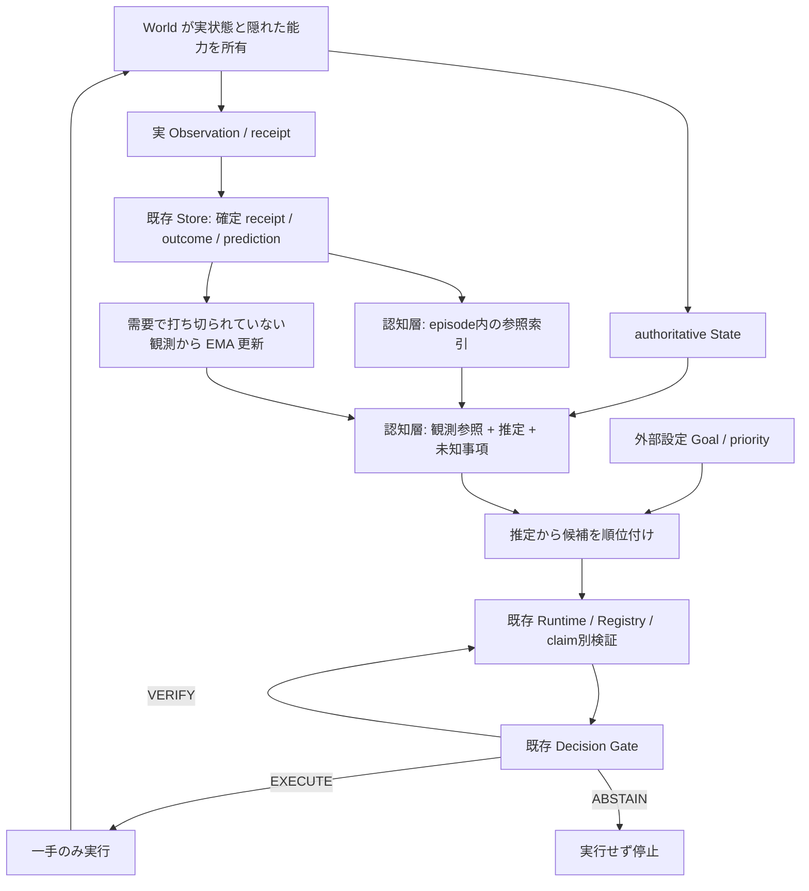

# 最小認知ループの設計と研究判断

2026-10-08。最小認知実装とCPU評価を完了。開発作業コピーの `deep-research-report.md`
（1298行）を全文確認した。レポート原文は公開物に含めず、参照した一次資料と判断を以下に記録する。

## 監査結果と実装範囲

Core は State/Action の指紋、Claim Definition/Instance、Registry、相関 family、
追加検証、Decision Gate、durable intent、one-action execution、Observation、
Prediction Ledger、Calibration を実装済み。consequence fixture は即時に安全だが
3 tick 後に overflow する行動を実際の Runtime が拒否する。Software は保護された
Python probe、Physical は MuJoCo を使う。既存361テストは今回の変更前に全て成功。
既存校正は実行された horizon-1 の成功/危険のみを対象にし、将来の仮想枝を
学習データにしない。これらを置き換えない。

新しい `cognition` は Core の外側に置く。認知層が所有するのは最新観測への参照、
推定/仮説、外部設定目標、既存Storeの確定済み outcome への記憶索引。
一回の Runtime を max_steps=1 で動かし、完了した実行receiptだけを取り込む。
次の一手は新しい Runtime で再観測・再検証する。Core/API/frontend契約は変更しない。

queue fixture を新規 production domain に拡張する。到着遅延、隠れた処理能力、
乱数による能力変動、途中の分布変化、holding cost、候補0/1/3を持つ。
既存fixtureや凍結プロトコルは変更しない。新規2D/Crafterより小さい依存コストで、
記憶・遅延・再計画・安全境界の寄与を切り分けられるため採用。

## 研究の根拠と区別

| 一次資料 | 実証/提案/仕様 | 今回の採用と限界 |
| --- | --- | --- |
| [Common Model, 2017](https://ojs.aaai.org/aimagazine/index.php/aimagazine/article/view/2744) | 認知構造の共通枠組みという提案 | working state・記憶・選択の責務分離。人間の脳の再現を実証したわけではない |
| [Soar公式manual](https://soar.eecs.umich.edu/soar_manual/02_TheSoarArchitecture/) | state/operator proposal/selection/application を定義 | 候補生成と実行を分離。production system/Soar本体は導入しない |
| [CoALA v3](https://arxiv.org/abs/2309.02427) | agentの分類・設計枠組みの提案、TMLR camera-ready | memory/internal action/external actionの境界。レポートの「査読版なし」はv3と一致しない |
| [PlaNet論文](https://arxiv.org/abs/1811.04551)、[公式実装](https://github.com/google-research/planet) | 画像制御タスクでlatent planningを実験 | 一手実行後の再計画という原理のみ採用。latent networkを実装したとは言わない |
| [Generative Agents](https://arxiv.org/abs/2304.03442) | sandboxと記憶等のablation | episodic retrievalの着想。LLM reflectionを観測や安全証拠に昇格しない |
| [W3C PROV-DM](https://www.w3.org/TR/prov-dm/) | 出所・生成・派生の標準仕様 | Storeの既存source reference/receiptを再利用。RDF追加不要 |
| [Guo et al., 2017](https://proceedings.mlr.press/v70/guo17a.html) | NN confidenceの校正を実験 | Brier/ECEと実行結果の整合。今回の数値モデルにNNの改善結果は外挿しない |

ACT-R/Global Workspace/Active Inferenceは機能配置・情報取得の参考に留め、
名前だけのモジュールやfree-energy計算を追加しない。MuZeroの意思決定量予測、
Dreamerの経験学習は将来のEngine設計の参考。レポートの「異種統合で改善する」
「独自性がある」は研究仮説であり既存論文の実証ではない。

公式OSSも確認した。PlaNetはApache-2.0だが2024-05-28にarchiveされ旧TensorFlow依存。
DreamerV3はMIT/JAXで独自学習基盤を持ち、今回のCPU最小実験には不要。
CrafterはMITで追加環境依存を伴うため外部評価の次段階に回す。
PRISM/Z3は現時点で不要な依存。CPUで有限queueの区間計算を独自実装し、
実測からの指数移動平均推定だけを追加する。既存Python/Pydantic/asyncio/SQLiteを利用し、
研究コードのコピーや新規依存は導入しない。

ライセンス原文: [PlaNet](https://raw.githubusercontent.com/google-research/planet/master/LICENSE)、
[DreamerV3](https://raw.githubusercontent.com/danijar/dreamerv3/main/LICENSE)、
[Crafter](https://raw.githubusercontent.com/danijar/crafter/main/LICENSE)。

## データフローと状態の所有者

新しいprediction/observationの型や別Ledgerは作らない。Beliefのobservedには
observed Stateだけを許可し、service推定は別のInferenceにsource referenceと
public boundを保持する。source_refsは証拠資格を与えない。
Phase 1のMemoryはStoreの完了receipt、入力state/action指紋、outcomeを毎回整合確認した。
Phase 2の[receipt-backed index](episodic-memory-index.md)は毎回run更新を照合し、
変更されたrunだけ同じreceipt検証器で再検証する。上記のPhase 1結果は保存したままとする。
同じreceiptを重複して数えず、未実行枝/未確定実行は取り込まない。

認知Agentは一episode専用。reset後は新しいAgentを使うことで暗黙の状態汚染を防ぐ。
記憶索引はmanifestのrun_idsを `remember` で復元できるが、意図しないepisode間の
知識転移は行わない。実行失敗時はRuntimeのpending intentを保持し、自動再試行せず
元Worldとの照合を必要とする。Worldの元Taskが変化した場合も停止する。

Goalはsoftな行動順位を決め、Task/Policyのhard constraintを変更できない。
検証器は公開されたservice>=1の最悪queue占有を計算する。学習モデルは
処理数と全処理完了確率を予測するだけで必須checkを解決できない。
未来の追加介入は含めず、既存pending jobsと今回の投入だけを3 tick検証する。
各roundのmax_calls=24、max_nodes=3。環境は行動でtickを進め、ABSTAIN中には進まない。

serviceは1または3。観測した処理数が需要より少なければ能力が観測でき、
需要>=3なら処理数が能力のsampleになる。需要1/処理1を能力1と誤解しない。
直近12件を読み、prior=3からalpha=0.5で再計算。これは実データで変わる推定だが、
Bayes filter、ニューラルWorld Model、厳密なPOMDP最適化ではない。
6 tickの候補価値は仮説計算であり、Gateのqualified utilityは安全候補間で同点となる。
したがってこの環境では提案順が選択に反映される。Coreの選択規則自体は変更しない。

## 反証可能な仮説と完了条件

- H1: 観測された処理数から推定を更新すると、固定推定より分布変化後の予測誤差と
  holding lossが小さくなる。同じ乱数系列で学習なし/記憶なしと比較する。
- H2: 最悪能力の区間検証をGateへ渡すと、単一の楽観モデル/反応型より危険率が低い。
- H3: 検証コストが不足したとき、認知層もVERIFY/ABSTAINを維持する。
- 成功条件: 実観測→記憶→候補→既存Runtime→Gate→一手→確定receipt→更新が
  CPUで複数tick動作。初期化、記憶の状態汚染、実行失敗、仮想枝の学習禁止、
  Gate迂回禁止のテストが成功。5構成以上の実測を保存し、劣る結果も記録する。

本環境での改善は汎用LLM agent/認知能力の優位性を証明しない。
長期神経学習、skill獲得、自発目標、異種モデルの汎用合成は今回の範囲外。

## 今回の追加・変更ファイル

既存作業ツリーの変更を保持し、この作業ではCoreや既存engine/API契約を編集していない。

| ファイル | 追加した責務 |
| --- | --- |
| `src/preact/cognition/__init__.py`, `models.py` | export、Goal、Belief、推定、経験参照、結果の型 |
| `src/preact/cognition/loop.py` | 既存Runtimeを一手単位で呼ぶ認知制御、Task/episode境界 |
| `src/preact/cognition/memory.py` | committed receiptを照合するStoreへの索引、重複排除 |
| `src/preact/cognition/queue.py` | 実観測からのEMAと候補順位の仮説計算 |
| `src/preact/cognition/benchmark.py` | 6構成・複数seedの実行、raw保存、指標、対応seed区間 |
| `src/preact/domains/cognitive_queue.py` | 私有する環境状態、遅延/能力変化/乱数/実行/観測/reset |
| `src/preact/engines/cognitive_queue.py` | unmeasured予測と公開下限の即時/未来検証 |
| `tests/test_cognition.py` | loop・安全・記憶・状態汚染・実行失敗の17件 |
| `tests/test_cognitive_benchmark.py` | 偽スコア・未来label・不完全な実験の拒否2件 |
| `scripts/summarize_cognition.py` | rawからの再集計、source/実行/label監査、日本語report |
| `benchmarks/cognitive-queue-v1.json` | 新規の再現protocol、既存protocolは維持 |
| `reports/cognitive-queue-v1-results.json` | 実測60episodeとsource/evidence hashes |
| `docs/cognitive-architecture.md`, `docs/cognitive-results.md` | 研究の区別、設計、実測と限界 |
| `README.md`, `AGENTS.md`, `docs/agent-progress.md` | 再現手順、構造、現在状態の追記 |

## 実行した検証

- 変更前: `UV_CACHE_DIR=.cache/uv uv run --offline pytest -q` — 361 passed (35.78s)。
- 最終: 同コマンド — 380 passed (43.28s)、うち新規19件。
- `uv run --offline ruff check src tests workers scripts` — 成功。
- `uv run --offline ruff format --check src tests workers scripts` — 138 files、成功。
- `npm --prefix web run contracts` / `npm --prefix web run build` — 成功。
- `PREACT_E2E_ARTIFACT_DIR=.cache/cognitive-e2e-artifacts npm --prefix web run test:e2e`
  — sandboxのport bind制限を解消して再実行、6 passed (8.2s)。
- benchmarkを初回/最終sourceで各60episode実行し、時間以外の全指標が一致。
  最終sourceのraw/指標/labelsを再監査し、日本語report/JSONの再生成がbyte単位で一致。
- `uv build --offline --out-dir .cache/cognitive-distributions-verified` と
  `python scripts/audit_distributions.py .cache/cognitive-distributions-verified --output
  .cache/cognitive-distribution-audit-verified.json` — wheel/sdist integrity成功。
  配布物のインストール実行や外部サービス検証を意味しない。
- 変更前に保存した既存protocol/dataset 54ファイルのSHA-256は全て一致。

新規依存、外部API、GPUは使わない。既存のスポンサー/クラウド/ハードウェア実検証は
今回のCPU研究では完了させていない。[実測と反例](cognitive-results.md)を参照。

## 公開範囲

公開mainを基点に、この認知拡張のみPRへ追加する。数値要約とsource/evidence hashesを
公開し、raw events/SQLite/artifactsは開発環境に保持する。既存の公開sourceは実測manifestと
byte一致。新しいoutputで再実行すれば、同じ指標・監査を再現できる。
