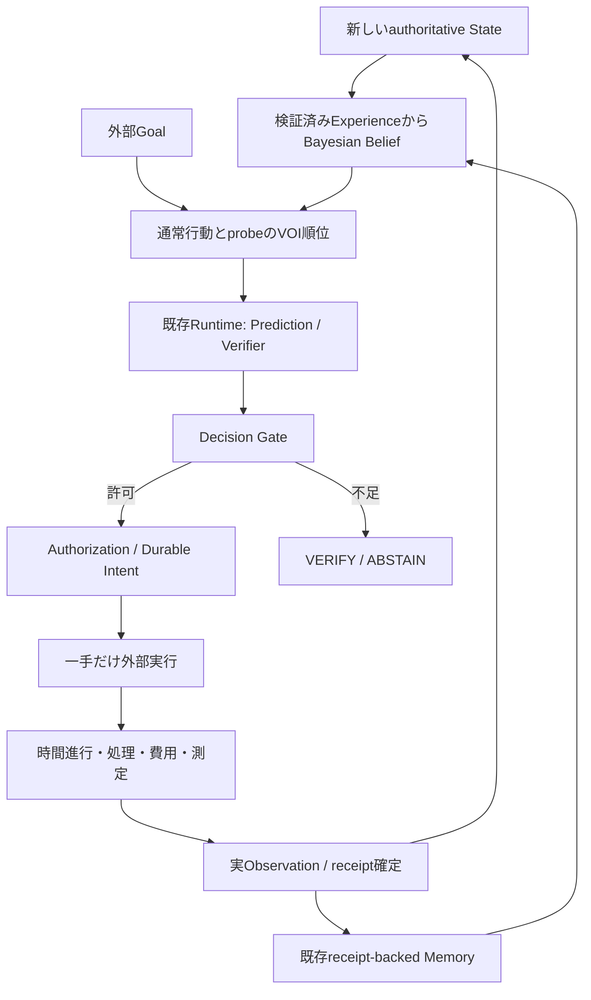

# Information-seeking Action v1 — 実行された情報だけを学ぶ

2026-10-09。公開main `b155576`（PR #5）を監査した独立追加。
Core、v1 queue、receipt-backed Memory、Belief Reuse契約は変更しない。
結果は [専用結果文書](information-seeking-results.md)、再現条件は
[固定protocol](../benchmarks/information-seeking-v1.json) を参照。

## 監査と設計判断

v1は能力1/3を隠し、2tick遅延で投入を受け取り、処理実績からEMAを更新する。
需要が1以下だと能力3でも1しか処理できず、通常観測は打ち切られる。
需要が十分なら通常行動でも能力を観測できる。この無料情報を無視するVOIは
probeを過大評価するため、今回のモデルは通常処理のBayesian更新も含める。
drainも時間を進めて仕事を処理する。probeが追加するのは正確な過去tickの測定である。

Gateは推論だけではmandatory checksを解決せず、Claimに対応する実行可能な検証器を要求する。
旧QueueBoundVerifierは `amount` を直接参照するため流用せず、Action semanticsを検証する
v2 verifierを追加した。Gateのutilityが等しい安全候補ではproposal順序が選択に寄与する。
VOIはこの順位を決めるsoftな計算であり、goal_progressや安全Evidenceとして報告しない。

## 行動と観測の意味

`InformationQueueWorld` はopt-in domain `cognitive_queue_v2`、Task/NO_OVERFLOW/DYNAMICS v2。
v1の通常行動・Claim・公開結果は保持する。新規依存はなくCPUで動く。

| Action | payload | 時間 | 投入 | 情報／追加費用 |
| --- | --- | --- | --- | --- |
| submit | amount=3/1 | 1 tick | 指定量、2tick遅延 | 通常の処理実績のみ |
| drain（submit 0） | amount=0 | 1 tick | なし | 通常の処理実績のみ |
| probe_service | 空dict | 1 tick | なし | 実行tickの能力1/3、probe_cost |

probe中も到着・既存queueの処理・保持損失は通常どおり。
報酬は `processed - holding_cost*post_queue - submission_cost*amount - probe_cost(if probe)`。
既定holding/submissionはv1と同じ0.25/0.1。probe_costは公開reward単位で既定0.05、
APIのドル建てcost_usdはCPU環境なので0。費用と1tickの投入機会損失を両方計算する。

executorだけがprivate scheduleを読む。実行前にはsampleを持たず、実行後のObservation.metricsに
`measured_service` と `measurement_tick=input tick` を追加する。新しいStateのpayloadは
測定値を含まない。したがって次tickのfresh observationも測定の時点を誇張しない。
measurementsは通常のcomplete execution receiptとoutcomeに保存する。
receipt文字列の形式検査自体は承認の証明ではなく、承認と永続化は既存Runtime/Storeの責務である。



## 推定モデルと出所

`InformationModel` は能力{1,3}の二状態Markov仮定。事前high確率0.5、持続率0.9。
これらはPlanner設定であり、実際のshift_tick、noise、high_first、隠れたscheduleを読まない。
通常のsampleは `processed=min(available, service)` に適合する能力だけに条件付ける。
available<=1の打切り観測はhigh確率を変えない。成功probeだけは正確な過去sampleを使う。
観測したtickから現在へは `p(t+d)=.5+(p(t)-.5)*(2*persistence-1)^d` と進める。
測定直後の次tickでも確率は0.1/0.9となり、能力を確定しない。

Memoryは既存Storeのrun更新検出・receipt内容整合・defensive copyをそのまま使う。
inferは取得した最新12件をtick順に再構成し、同じreceiptを二重計上しない。
入力と結果のdomain/provenance、tick+1、available、binary能力、処理数、queue transitionを照合する。
失敗・unsafe probeはsampleとして使わず、不正な測定tickや意味的不整合は例外にする。
pending/aborted/forged outcomeはMemory層で拒否される。未実行候補はExperienceにならない。
事実は `Belief.observed`、サービス確率/期待値/取得probe数はInferenceとsource_refs、
現在能力・未来能力・変化時点はunknownに残す。Memory参照に安全証明の資格はない。

外部writerのcommitは既存Memoryの次のretrieveで検出する。既存append-only/時点整合境界を継承し、
新しいauthorityや任意に長いsnapshot保証は導入しない。Agentは一episode専用、reset後は新規Agent。
今回PlannerはBelief Reuseにopt-inしないため、reuseを有効にしても毎回retrieve/inferする。
設定変更・時間依存・例外の後に古い推定へfallbackしない。

## 小さなVOIと限界

最大6tick（設定2〜8、残りepisodeで短縮）の有限動的計画をCPUで行う。
通常行動3/1/0だけのBayesian適応継続を計算し、その最初の一手をprobeに置き換えた期待値と比較する。
probe後に再度probeすることまで最適化するPOMDP solverではない。実agentは毎tick再計画する。
将来の到着・処理・holding/submission費用を同じpublic transitionで評価し、通常処理の
情報更新も継続に織り込む。モデル上の将来行動は予測計算であり、実行承認ではない。

`Q_drain`=通常drain後に通常行動だけで適応する価値、`Q_normal`=最良の通常行動価値。
`Q_probe`=測定費用を含むprobe後の通常適応価値。

- information_gain = max(0, Q_probe + probe_cost - Q_drain)
- opportunity_cost = max(0, Q_normal - Q_drain)
- net_voi = information_gain - opportunity_cost - probe_cost

通常行動の最良値はpublic boundに適合する候補から計算するが、この計算はGateを代替しない。
VOI方式は未達目標があり、継続tickがあり、net>0で測定が将来の通常行動を変える場合だけ
probeを先頭に置く。不確実性だけでは選ばない。周期方式は4tickごと、不確実性方式は
`4*p*(1-p)>.75` で測定を試みる。後二者は費用を無視する比較対象。
各Action.rationaleにmodel設定、gain/opportunity/cost/net、条件付き次行動を記録する。
長期報酬を全episodeで最適化する保証、最適なmultiple-goal配分、連続能力やnoisy sensor対応はない。

NO_OVERFLOW v2は公開service>=1で、今回Actionを初tickだけ適用し、以後投入なしの3tickを検証する。
immediate capacityとfuture Claimを別エンジンで解決する。probeはamount0の意味なので
payloadにamountを追加せず、正式contractからゼロ投入へ写像する。
Inference forecastは予想処理数のみを出し、測定値やmeasured safetyを作らない。

## 研究上の位置づけ

[Howard, Information Value Theory (1966), IEEE公式abstract/書誌](https://ieeexplore.ieee.org/document/4082064/)
は確率だけでなく意思決定の経済的結果を合わせて情報価値を考える根拠。
本文アクセスはJS制約があり、公式abstractの確認範囲を超える追試・定理の実装は主張しない。
今回の有限binary modelと機会費用式は独自の明示的近似であり、論文の実験結果を再現したものではない。
[CoALA](https://arxiv.org/abs/2309.02427) の内部処理／外部環境への行動の区別を踏襲し、
probeを内部Memory呼出しで代用しない。Active Inferenceのfree energyやニューラル学習は実装していない。
新しいOSS依存や研究コードのコピーはなく、既存PreAct/Python/Pydantic/asyncio/SQLAlchemyを利用する。
改善の実証範囲は専用CPU queueのpaired実験だけ。LLM agent・実ロボット・一般認知能力の改善とは区別する。

## 再現

```sh
uv sync --frozen --extra dev --extra physical --extra sandbox
uv run python -m scripts.bench_information_seeking \
  --protocol benchmarks/information-seeking-pilot-v1.json \
  --output .cache/information-pilot-NEW --report .cache/information-pilot-report.json
uv run python -m scripts.bench_information_seeking \
  --protocol benchmarks/information-seeking-v1.json \
  --output .cache/information-main-NEW --report .cache/information-main-report.json
uv run pytest -q tests/test_information_seeking.py
uv run python -m scripts.audit_information_seeking \
  --protocol benchmarks/information-seeking-v1.json \
  --report .cache/information-main-report.json --raw .cache/information-main-NEW
```

NEW outputは存在しない場所を指定する。raw DB/events/traceはprivate cacheにのみ保存。
公開JSONはprotocol/source hash、seed別集計、意味トレースhash、予算対照、監査結果を持つ。
反復は可変ID/timestampを正規化し、正規化前にGate evidence digest・receipt全文・入力指紋を検証する。
旧benchmarkの共通semantic audit関数だけを再利用し、過去protocol/結果は上書きしない。
追加auditorはprotocol/source/全条件/集計/費用/反復を再計算する。任意の `--raw` では
original Gate policy/evidence hashとcomplete receiptも再照合する。
予算対照だけはpolicy hashが異なり、探索制御イベントでLedger seqもずれるため、
seq参照を対象event種別・出現順へ写像し、出所の関係を保ったままpolicy hash以外の
全意味トレースを比較する。同じ設定の2反復は元の厳密な正規化hashを比較する。
pilotは探索的な1反復であり、mainの2反復再現性と区別する。
