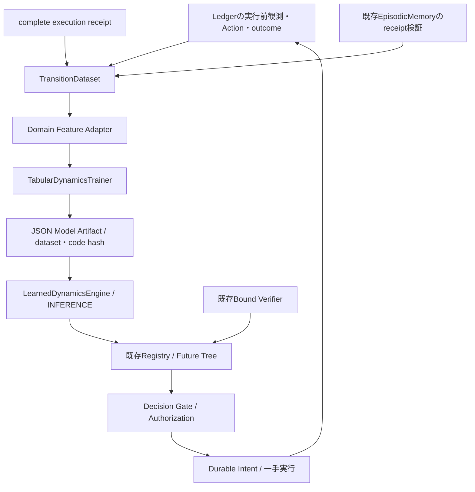

# Receipt-backed Dynamics Learning：設計と監査

## 目的と資料の扱い

公開main `0b3e88bf`（PR #6/#7 merge済み）を監査し、ローカルの
`deep-research-report (1).md` 全349行を読んだ。研究原文は公開成果物に含めない。
今回は「実経験 → 遷移学習 → FutureEngine」の欠落を埋める。
これは機能の接続を検証する最小実装であり、汎用世界理解の実証ではない。

| レポートの課題 | 現行の区分 | 根拠と今回の判断 |
| --- | --- | --- |
| 観測・予測・検証・Gate・一手実行 | 実装済み | `core/runtime.py`, `registry.py`, `decision.py`; `test_authority_contracts.py`, `test_runtime.py`。変更しない |
| receipt・Memory・Belief・情報獲得・Software接続 | 実装済み | `cognition/memory.py`, `belief.py`, `information.py`, `world.py`; `test_memory_index.py`, `test_software_cognition.py`, `test_information_seeking.py`。再実装しない |
| 汎用遷移Dataset・Dynamics訓練 | 未実装 | MemoryはExperience、Calibrationは予測の信頼性を扱う。世界の状態遷移を訓練する契約はない |
| 確率的予測・複数step・反実仮想 | 部分的 | `Prediction.outcomes`, `future_states`, `conditioning`とRegistry検証は既存。新しい分布契約を追加する必要はない。学習分布のrollout・因果介入は未実装 |
| モデルlifecycle | 部分的 | `Artifacts`にhash検証付き保存がある。訓練・評価の識別、drift/rollbackは不足 |
| 汎用vector/多モダリティの認知的効果 | 契約あり・効果未検証 | `core/models.py`の`Prediction.vectors`とState payload、remote worker契約はある。統合による能力向上を示す本実験はない |
| マルチモーダル・Physical・Sandbox | 部分的 | workers/remote enginesと観測契約はある。汎用fusion、強いOS隔離、実機での安全性は今回未検証 |
| Factored/latent/causal representation | 未実装 | State payloadはdomain定義。既存契約だけで学習表現の能力を実証したとは言えない |

レポートの優先順位は提案として採用する。
[MBRL survey](https://arxiv.org/abs/2006.16712)のモデル学習・計画・部分観測の区別を
責務分担の根拠にする。[PETS](https://arxiv.org/abs/1805.12114)は不確実性を扱う
学習モデルの有用性を特定の制御課題で実証しているが、本実装はPETS/ensemble/MPCではない。
[W3C PROV-DM](https://www.w3.org/TR/prov-dm/)のentity/activity/derivationの区別に沿い、
観測・実行・派生モデルの出所を保持する。これらは本実装の効果を保証しない。

## 最小縦切り



Datasetは明示的なepisode→run manifestを用いる。Memoryのuncached `read()`で
全outcomeとreceiptを検証し、実観測・Action binding・authorization・時間順序を追加確認する。
PredictionやBeliefは教師にならない。未実行branchは抽出しない。同一receiptは検証後に重複排除。
completeでもoutcomeが欠ければ補完しない。pending/abortedは教師にならず、偽outcomeは全体を拒否。
`Observation.success=False`はタスク未達の場合もあるので除外せず、実際の状態変化を学習する。
例外・キャンセルで確定観測がない場合は除外する。`unlabelled_receipts`にpending/aborted/
completeの状態を残す。round間の外生変化は`continuous_from_previous=False`として記録し、
前Actionの結果へ混ぜない。時刻逆転・episode内domain変更は拒否する。

前StateはRuntime開始時のLedger `observed` event。実行直前のfresh observationは既存Runtimeが
内容IDの一致を確認するが、その新timestamp自体はLedgerに記録していない。このため「実行直前の
正確な壁時計State」とは主張しない。`observed_elapsed_seconds`は開始時観測から結果観測までで、
探索時間を含む。`declared_action_duration`はdomainの単位であり、壁時計秒と同一視しない。

学習契約はdomain非依存。adapterが公開State/Actionを特徴・観測後の変化に変換する。
最初はCPUの条件付き平均回帰（表形式、件数・平均・分散・標本範囲）を採用する。
EMAや既存Bayesian Beliefを改名せず、batchの実遷移から別モデルを訓練する。
Queue v2 adapterだけがarrival/action仕様を知り、queue/deliveredの変化を教師にする。
隠れたserviceや将来scheduleは入力にも教師にも使用しない。

未学習・未見cell・データ不足・互換性不一致・推論失敗はunknown。
学習エンジンはhorizon=1のmetric予測のみ、mandatory checkも成功/危険の確定値も返さない。
標本範囲は校正済み確率区間や安全境界ではない。モデルは歴史的データから得た推定にすぎない。
予測だけでGateを通過できず、既存Verifierが必要。既定Registry/CLIは変更しない。

## 整合性・寿命

訓練は毎回Datasetをauthorityから再構築する。前後の`Store.run_heads()`比較により
appendとreceipt-only更新・外部writerを検出し、変化中なら失敗する。
これはStoreのappend-only契約内の時点検証であり、訓練中の全DBをロックするものではない。
in-place Ledger改変・DB巻戻しは既存Store契約外。再訓練には再検証が必要。
既存モデルは識別された歴史的snapshotの派生物で、現在の安全性authorityにはならない。

Artifactは既存`Artifacts`へJSONで保存しhash・schema・adapter互換性を検証する。
dataset/receipt/run/episode識別、設定、seed、コードhash、model versionを追跡する。
seedは記録するが、このbatch平均回帰には乱数処理がない。重みのonline更新・自動昇格はしない。

adapterが自由にWorldを参照することをPython言語レベルで禁止するsandboxではない。
公開adapterはpure変換を契約とし、queue実装はWorld参照を持たずprivate schedule読出しを
否定テストで禁止する。callerが任意Pythonを注入する安全境界は拡張していない。

## 開発者向けのopt-in例

```python
from preact.learning import TransitionDataset, TabularDynamicsTrainer, DynamicsModel
from preact.domains.queue_features import QueueDynamicsAdapter
from preact.engines.learned_dynamics import LearnedDynamicsEngine
from preact.engines.information_queue import InformationBoundVerifier
from preact.core.registry import Registry

# store / artifacts / world are existing instances; run IDs come from actual episodes.
dataset = TransitionDataset(store, {"training-episode": completed_run_ids})
adapter = QueueDynamicsAdapter()
model = await TabularDynamicsTrainer().fit(dataset, adapter)
artifact_hash = model.save(artifacts)
model = DynamicsModel.load(artifacts, artifact_hash, adapter)
registry = Registry([
    LearnedDynamicsEngine(world.task, adapter, model),
    InformationBoundVerifier(world.task),
    InformationBoundVerifier(world.task, future=True),
])
# Pass registry to the existing Runtime or a fresh CognitiveAgent.
```

別domainでは`DynamicsAdapter`のfeatures/targets/decodeとspecificationを定義する。
すべての設定をspecificationに含め、モジュールsource hashで互換性を束縛する。
Notebook等でsourceを検証できないadapterは拒否する。モデルのcellはimmutableな数値tuple。
学習対象はdelta、Decodeはdomainで定義するmetricへ変換する。queue adapterは現在tickの
queue/deliveredだけを予測し、pending配置・多step展開は今回の学習対象ではない。

## 受入基準・予定ファイル

`learning/transitions.py`, `learning/dynamics.py`, `domains/queue_features.py`,
`engines/learned_dynamics.py`に追加し、Core/Gate/Memoryの意味を変えない。
専用テストで偽造・未実行・順序・外部更新・再現性・unknown・誤予測時Gateを検証する。
新しいprotocol/script/resultsでepisode分離のheld-out予測、学習曲線、既存queue方式、
shift、CPU/wallを計測する。意思決定の改善は予測改善とは別に扱う。

今回見送る: latent/factored/causal表現、確率rollout、融合、OS Sandbox、execution
reconciliation、drift/rollback、分散学習。安全な再開とモデル失効は次の候補とする。
