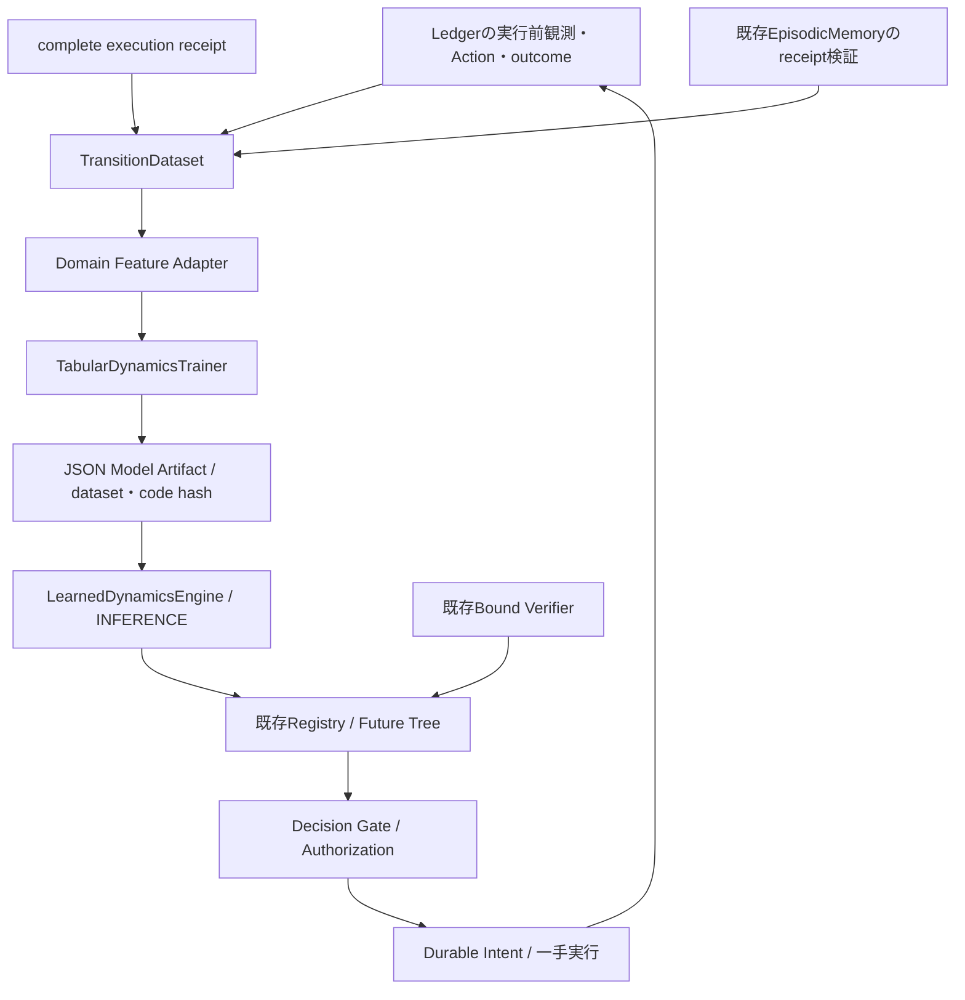
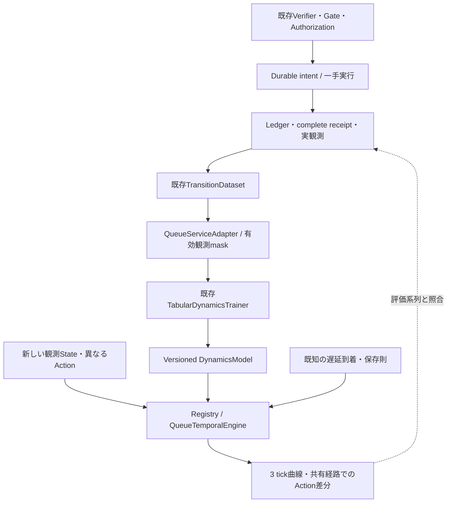
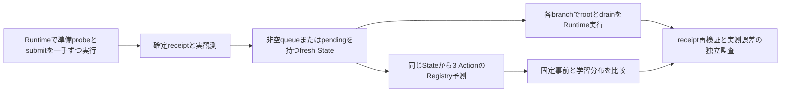
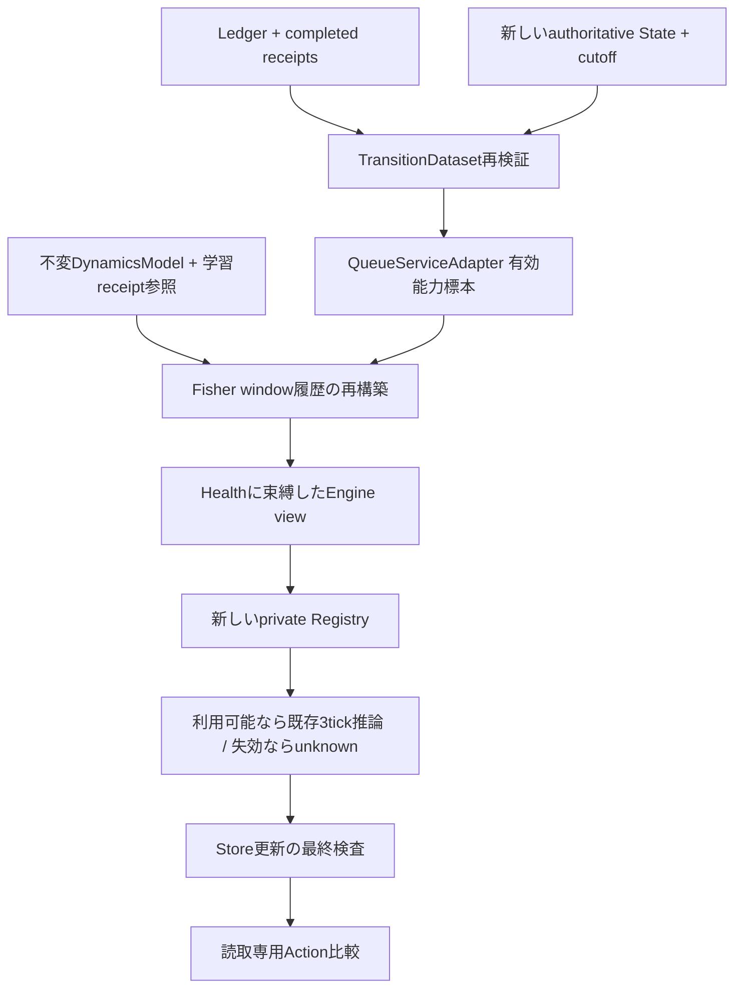

# Receipt-backed Dynamics Learning：設計と監査

## 目的と資料の扱い

公開main `0b3e88bf`（PR #6/#7 merge済み）を監査し、ローカルの
`deep-research-report (1).md` 全349行を読んだ。研究原文は公開成果物に含めない。
今回は「実経験 → 遷移学習 → FutureEngine」の欠落を埋める。
これは機能の接続を検証する最小実装であり、汎用世界理解の実証ではない。

| レポートの課題 | 現行の区分 | 根拠と今回の判断 |
| --- | --- | --- |
| 観測・予測・検証・Gate・一手実行 | 実装済み | `core/runtime.py`, `registry.py`, `decision.py`; `test_authority_contracts.py`, `test_runtime.py`。変更しない |
| receipt・Memory・Belief・情報獲得・Software接続 | 実装済み | `cognition/memory.py`, `belief.py`, `information.py`, `world.py`; `test_memory_index.py`, `test_software_cognition.py`, `test_information_seeking.py`。再実装しない |
| 汎用遷移Dataset・Dynamics訓練 | 未実装 | MemoryはExperience、Calibrationは予測の信頼性を扱う。世界の状態遷移を訓練する契約はない |
| 確率的予測・複数step・反実仮想 | 部分的 | `Prediction.outcomes`, `future_states`, `conditioning`とRegistry検証は既存。新しい分布契約を追加する必要はない。学習分布のrollout・因果介入は未実装 |
| モデルlifecycle | 部分的 | `Artifacts`にhash検証付き保存がある。訓練・評価の識別、drift/rollbackは不足 |
| 汎用vector/多モダリティの認知的効果 | 契約あり・効果未検証 | `core/models.py`の`Prediction.vectors`とState payload、remote worker契約はある。統合による能力向上を示す本実験はない |
| マルチモーダル・Physical・Sandbox | 部分的 | workers/remote enginesと観測契約はある。汎用fusion、強いOS隔離、実機での安全性は今回未検証 |
| Factored/latent/causal representation | 未実装 | State payloadはdomain定義。既存契約だけで学習表現の能力を実証したとは言えない |

レポートの優先順位は提案として採用する。
[MBRL survey](https://arxiv.org/abs/2006.16712)のモデル学習・計画・部分観測の区別を
責務分担の根拠にする。[PETS](https://arxiv.org/abs/1805.12114)は不確実性を扱う
学習モデルの有用性を特定の制御課題で実証しているが、本実装はPETS/ensemble/MPCではない。
[W3C PROV-DM](https://www.w3.org/TR/prov-dm/)のentity/activity/derivationの区別に沿い、
観測・実行・派生モデルの出所を保持する。これらは本実装の効果を保証しない。

## 最小縦切り



Datasetは明示的なepisode→run manifestを用いる。Memoryのuncached `read()`で
全outcomeとreceiptを検証し、実観測・Action binding・authorization・時間順序を追加確認する。
PredictionやBeliefは教師にならない。未実行branchは抽出しない。同一receiptは検証後に重複排除。
completeでもoutcomeが欠ければ補完しない。pending/abortedは教師にならず、偽outcomeは全体を拒否。
`Observation.success=False`はタスク未達の場合もあるので除外せず、実際の状態変化を学習する。
例外・キャンセルで確定観測がない場合は除外する。`unlabelled_receipts`にpending/aborted/
completeの状態を残す。round間の外生変化は`continuous_from_previous=False`として記録し、
前Actionの結果へ混ぜない。時刻逆転・episode内domain変更は拒否する。

前StateはRuntime開始時のLedger `observed` event。実行直前のfresh observationは既存Runtimeが
内容IDの一致を確認するが、その新timestamp自体はLedgerに記録していない。このため「実行直前の
正確な壁時計State」とは主張しない。`observed_elapsed_seconds`は開始時観測から結果観測までで、
探索時間を含む。`declared_action_duration`はdomainの単位であり、壁時計秒と同一視しない。

学習契約はdomain非依存。adapterが公開State/Actionを特徴・観測後の変化に変換する。
最初はCPUの条件付き平均回帰（表形式、件数・平均・分散・標本範囲）を採用する。
EMAや既存Bayesian Beliefを改名せず、batchの実遷移から別モデルを訓練する。
Queue v2 adapterだけがarrival/action仕様を知り、queue/deliveredの変化を教師にする。
隠れたserviceや将来scheduleは入力にも教師にも使用しない。

未学習・未見cell・データ不足・互換性不一致・推論失敗はunknown。
学習エンジンはhorizon=1のmetric予測のみ、mandatory checkも成功/危険の確定値も返さない。
標本範囲は校正済み確率区間や安全境界ではない。モデルは歴史的データから得た推定にすぎない。
予測だけでGateを通過できず、既存Verifierが必要。既定Registry/CLIは変更しない。

## 整合性・寿命

訓練は毎回Datasetをauthorityから再構築する。前後の`Store.run_heads()`比較により
appendとreceipt-only更新・外部writerを検出し、変化中なら失敗する。
これはStoreのappend-only契約内の時点検証であり、訓練中の全DBをロックするものではない。
in-place Ledger改変・DB巻戻しは既存Store契約外。再訓練には再検証が必要。
既存モデルは識別された歴史的snapshotの派生物で、現在の安全性authorityにはならない。

Artifactは既存`Artifacts`へJSONで保存しhash・schema・adapter互換性を検証する。
dataset/receipt/run/episode識別、設定、seed、コードhash、model versionを追跡する。
seedは記録するが、このbatch平均回帰には乱数処理がない。重みのonline更新・自動昇格はしない。

adapterが自由にWorldを参照することをPython言語レベルで禁止するsandboxではない。
公開adapterはpure変換を契約とし、queue実装はWorld参照を持たずprivate schedule読出しを
否定テストで禁止する。callerが任意Pythonを注入する安全境界は拡張していない。

## 開発者向けのopt-in例

```python
from preact.learning import TransitionDataset, TabularDynamicsTrainer, DynamicsModel
from preact.domains.queue_features import QueueDynamicsAdapter
from preact.engines.learned_dynamics import LearnedDynamicsEngine
from preact.engines.information_queue import InformationBoundVerifier
from preact.core.registry import Registry

# store / artifacts / world are existing instances; run IDs come from actual episodes.
dataset = TransitionDataset(store, {"training-episode": completed_run_ids})
adapter = QueueDynamicsAdapter()
model = await TabularDynamicsTrainer().fit(dataset, adapter)
artifact_hash = model.save(artifacts)
model = DynamicsModel.load(artifacts, artifact_hash, adapter)
registry = Registry([
    LearnedDynamicsEngine(world.task, adapter, model),
    InformationBoundVerifier(world.task),
    InformationBoundVerifier(world.task, future=True),
])
# Pass registry to the existing Runtime or a fresh CognitiveAgent.
```

別domainでは`DynamicsAdapter`のfeatures/targets/decodeとspecificationを定義する。
すべての設定をspecificationに含め、モジュールsource hashで互換性を束縛する。
Notebook等でsourceを検証できないadapterは拒否する。モデルのcellはimmutableな数値tuple。
学習対象はdelta、Decodeはdomainで定義するmetricへ変換する。queue adapterは現在tickの
queue/deliveredだけを予測し、pending配置・多step展開は今回の学習対象ではない。

## 受入基準・予定ファイル

`learning/transitions.py`, `learning/dynamics.py`, `domains/queue_features.py`,
`engines/learned_dynamics.py`に追加し、Core/Gate/Memoryの意味を変えない。
専用テストで偽造・未実行・順序・外部更新・再現性・unknown・誤予測時Gateを検証する。
新しいprotocol/script/resultsでepisode分離のheld-out予測、学習曲線、既存queue方式、
shift、CPU/wallを計測する。意思決定の改善は予測改善とは別に扱う。

今回見送る: latent/factored/causal表現、確率rollout、融合、OS Sandbox、execution
reconciliation、drift/rollback、分散学習。安全な再開とモデル失効は次の候補とする。

## 2026-10-10 承認判断：学習した能力分布による時間的Action比較

PR #8の上記記録は一手先学習の履歴として保持する。追加するのはQueue v2の
最大3 tickの読み取り専用比較。Core、Trainer、State/Action、Gate、Memoryの意味は変えない。
既存学習モデルの直接反復、複数tickの直接教師化、全Dynamicsの再学習を検討し、
最小範囲として「実経験から学ぶ能力分布＋既知の遅延到着・保存則」を開発者が承認した。

### 学習するものと既知のもの

`QueueServiceAdapter`は既存Datasetから、能力を識別できたか、高能力だったか、
probe由来か通常実績由来かの4つの指標を返す。正式なprobe測定、または
available_work>=3で処理能力1/3を識別できる成功実績だけが有効標本である。
需要不足・失敗にはmask=0を使う。これは能力ゼロ・低能力の教師ではない。

`TabularDynamicsTrainer`をそのまま使い、cell.countは全遷移数、有効数は
`cell.count * mean(informative)`、高能力数は`cell.count * mean(high_and_informative)`
として別々に復元する。高能力確率は高能力数/有効数。有効数がmin_samples未満ならunknown。
probe/ordinaryの件数も別に返す。新Adapterを別ファイルに置き、既存Adapter source hashを保つ。
教師の入手可能性だけがmaskを決め、実観測に含まれない隠れたscheduleは読まない。

投入量・2 tick後の到着・仕事の保存・処理上限は既存の公開規則である。
これらを学んだとは主張しない。学習するのは、識別可能な実績から得た能力1/3の周辺分布。
tick間独立・短期間定常・Actionから能力への影響なしはモデル仮定であり、学習済み事実ではない。
需要不足による選別が能力分布を歪めないという仮定にも依存する。非定常/相関環境では限界がある。

### 時間と予測契約

`QueueTemporalEngine`は整数の分岐状態を最大8通り列挙し、各分岐へ同じ既知規則を適用する。
最初のActionの仕事をpendingとして保持するので、即時の差がゼロでも後続tickへ影響が残る。
平均Stateを再びモデルへ入力しない。既存Prediction.vectorsに期待queue/delivered/pendingを返し、
分岐・重みはboundedなraw派生結果として保持する。authoritative Stateや第二Ledgerは作らない。

horizon>1は既存NO_OVERFLOW ClaimInstanceとDYNAMICS_V2のenvironment_only条件に束縛する。
これは継続条件の明示であり、学習エンジンはそのcheckを解決しない。INFERENCE、check結果なし、
mandatory_checksなし、success/riskはunknown。Registryのscope/identity/予算検査を通す。
各Action最大8経路、3候補最大24経路を明示的に確保する。不足ならunknown。
既定Registry/CLI/Plannerは変更せず、比較結果を候補順位・承認へ使わない。

全1/3経路のsupport rangeは既知のモデル内範囲であり、確率区間でも安全証明でもない。
別途iid標本を仮定したWilson 95%の能力確率区間と、その両端での平均予測の感度を返す。
これらも時間相関や隠れたshiftに対して校正済みではない。
比較では同じ外生能力経路を全Actionへ適用し、独立な予測として差分の幅を合成しない。



### opt-in API

```python
from preact.domains.queue_service_features import QueueServiceAdapter
from preact.engines.queue_temporal import QueueTemporalEngine, compare_actions
from preact.learning import TabularDynamicsTrainer
from preact.core.registry import Registry

# dataset is an existing receipt-backed TransitionDataset, never a fabricated snapshot.
model = await TabularDynamicsTrainer().fit(dataset, QueueServiceAdapter())
state = await world.observe()
actions = [world.action(state, n) for n in (3, 1, 0)]
engine = QueueTemporalEngine(world.task, model)
comparison = await compare_actions(Registry([engine]), engine, state, actions)
# comparison never executes; actual actions still require the existing Runtime.
```

固定事前baselineには`QueueTemporalEngine(world.task, prior=0.5)`を使う。
同じ既知Dynamics・初期状態・Action・列挙予算を保ち、学習した分布だけを置き換える。
同じデータ/設定の再訓練は同じモデルになり、保存/読込は既存DynamicsModel/Artifactsを使う。
モデルは検証時点の歴史的snapshotの派生物で、推論ごとのreceipt再検証や自動失効は行わない。
新しいfitと監査はauthorityを再検証する。旧モデルを現在の観測や安全性authorityとして扱わない。

### 評価・受入境界

別episode/seedで学習・評価を分離し、同じseedとprobe prefixでWorldを再構成する。
予測はroot実行前に記録。rootの後には正式なdrainを一手ずつGateに通す。
drainは外部Actionであり、「追加投入なし」のenvironment_onlyとQueue/処理の遷移が一致する。
無断で時間を進めない。ABSTAINなら実測は成立せず、不完全な評価を成功として報告しない。
これは共通外生条件での条件付きAction比較であり、汎用因果推論の実証ではない。

未学習/有効数不足/公開schema・provenance不一致/残りtick不足/推論失敗はunknown。
不正なState内容IDやClaim/capabilityを再検証が拒否する場合は例外で停止し、旧予測へfallbackしない。
隠れた分布変化は同じ公開Stateから必ず検出できるものではなく、誤予測を起こし得る。
安定・ノイズ・shiftを固定protocolで測り、shift前後も集計する。
cell.countと有効数、coverage、状態誤差、Action差分誤差、CPU/wall、失敗条件を報告する。
意思決定の改善、一般化された因果理解、校正済み安全性は今回の受入対象外。

次の候補は、時間相関・分布変化の検出とモデル失効、独立データでの区間校正、
その後に予測比較を意思決定へ接続する価値の検証。今回LLM/latent/汎用rollout/UIは追加しない。

### 2026-10-10 PR #9レビュー対応：非空初期状態の追加評価

空queue/pendingからの既存評価はそのまま保持する。追加の
[非空初期状態protocol](../benchmarks/queue-temporal-nonempty-v1.json)では、
既存benchmark/auditorに任意の`workload_prefixes`を追加した。省略時は従来のprobe-only条件。
これは評価の拡張であり、Core/Gate/Engine/Adapter/Trainerの契約や実行経路を変更しない。

準備probeを0または8 tick実行後、`pending: [3]`または
`queue_and_pending: [3,3]`を通常Runtimeで一手ずつ実行する。
各Action branchを同じseed・外部条件・prefixで再構成し、fresh観測をroot入力にする。
queue/pendingの直接書換えは行わない。prefixにも通常Verifier・Gate・Authorization・
durable intent・complete receiptが必要。監査はreceiptを再検証し、最後のprefixの
実観測、root前観測、分析入力のpayload/provenance一致と連続性を確認する。



到着する既存仕事があるため、drainやsubmit(1)でも能力1/3により処理量が変わる。
例えば正式submit(3)を2回実行したlow環境ではtick2にqueue2、pending3が残る。
その後3 tickのdeliveredは能力が常に1なら全Actionで`[2,3,4]`、常に3なら
submit(3)は`[4,7,9]`、submit(1)は`[4,7,7]`、drainは`[4,6,6]`。
この単純な両端例は既知規則と能力の関係を示すもので、学習効果の実証とは分ける。
学習寄与は同じ初期State・同じ列挙経路に対する固定事前/学習分布のheld-out誤差で測る。

追加集計はAction別のqueue/delivered MAE、1/2/3 tickのdelivered MAE、
初期状態の非空件数、receipt-backed準備遷移数を含む。
`service_sensitive_comparisons`は全binary service経路でdelivered曲線が異なる比較数で、
確率保証や校正指標ではない。p=0/1モデルでも経路supportには未観測能力を含む。
全サイズを残し、状態誤差と差分誤差が異なる方向に変わる場合も併記する。
追加評価でもprefixの測定/実績を学習モデルに混ぜず、予測を教師にしない。

## 承認済み追加設計: Dynamics drift監視

確定経験の直近ウィンドウと学習時の有限能力標本を両側Fisher検定で比較する。
既存Calibrationは予測信頼度、online Beliefは現在状態の推定であり、ここでは
固定モデルの環境分布仮定と利用可否を扱う。Trainer/Adapter/TransitionDatasetは再利用する。
既定値は学習有効数16、直近16（8から判定）、割合差0.10、総alpha0.05、
`alpha_k=0.05/(k*(k+1))`、有効観測なし16tickを超えれば不足扱い。
同一prefixの再判定は同じlookを再構築し、追加の検定予算を使わない。
統計的失効はmodel/episode scopeでラッチする。検証失敗は統計的driftと区別する。

監視付き入口は毎回receiptと観測時系列を再検証し、immutable Health viewと
新しいRegistryを生成する。失効時はINFERENCE unknownを返す。
既存QueueTemporalEngine直接呼出しは監視対象外であり、Core/Gate/実行権限は変更しない。
新しいAPIはAction比較専用で、ランキングや自動再学習・昇格・rollbackは行わない。



統計的有意差を環境変化の確証、未検出を定常性の証明、unknownを安全証明とは扱わない。
有限標本、時間相関、選択・検閲、緩やかな変化と逐次alpha減少に検知限界がある。

### 監視APIと責務

```python
from preact.engines.queue_temporal_guard import QueueTemporalGuard

# model/training_manifest are produced by the existing receipt-backed Trainer.
# Persist this initial State and the complete ordered manifest for restart/replay.
initial = await world.observe()  # tick 0; supplied by the authoritative World
monitor = QueueTemporalGuard(
    store, world.task, model, training_manifest,
    episode_id="deployment-episode", initial=initial,
)
state = await world.observe()  # never replaced with an old observation
comparison = await monitor.compare(
    state, [world.action(state, n) for n in (3, 1, 0)], completed_run_ids,
)
# Read-only inference, NOT authorization. Use the existing Runtime for execution.
health = await monitor.health(await world.observe(), completed_run_ids)
```

`learning/drift.py`はdomainを知らないBernoulli判定だけを扱う。
`engines/queue_temporal_guard.py`はQueue v2のteacher mask、receipt/時系列/Task検証、
モデル適合性・統計値の再照合、監視付き予測入口を担当する。
Trainerを同じ学習receiptに対して再計算して整合性を検証するが、新しい経験でモデルを
再学習・置換する処理ではない。この保守的な再検証の計算コストは計測対象である。

返すHealthの状態は`insufficient_data`（学習/最近の有効数不足・観測の陳腐化）、
`available`（失効条件に達していない）、`suspected`（割合差>=0.10かつnominal p<=0.05だが
逐次閾値に未達）、`invalidated`（逐次p閾値と割合差の双方を満たす、scope内でラッチ）。
互換性・破損・未確定実行・偽造・cutoff不整合は統計的状態と混同せず例外で拒否する。
`available`も定常性の証明ではなく、有限標本に基づく利用判断にすぎない。

model version、学習dataset hash、監視prefixのbasis hash、scope/cutoff、config、
全lookの学習/最近の標本数・high数・割合差・p・alpha・出所referenceを返す。
Health hashとguardコードhashと元モデルversionでEngine view versionを生成する。
Predictionは元モデルversion/学習dataset hashとHealth/view versionを保持し、
INFERENCE・未確定success/risk・未解決mandatory safety checksを維持する。
個々のlookは新しい有効receiptにのみ対応し、同じ履歴の再読込でalphaを二重消費しない。
failed/censored teacherはwindowを増やさない。失効後に分布が戻っても自動復活しない。

### 有効性の範囲と失敗時の動作

監視manifestは一つの実World episodeを所有する呼出し側が管理する。
学習episode/run/receiptとmonitoringを分離し、initial tick0から連続する全実遷移を要求する。
Training observation/outcome確定時刻<=deployment initial時刻、各after/outcome確定時刻<=現在観測時刻、
最後の実観測と現在Stateの全内容（timestamp以外）一致、現在時刻の非逆転を検証する。
Domain/provenance/schema/uncertaintyなどを含め、State IDだけを根拠にしない。
Scope中のmanifest切り詰め・差し替え、別Task、future receipt、未確定/aborted intentは拒否する。
再開時は**同じモデル・config・initial・scopeと全ordered manifest**を提供して履歴を再構築する。
新しいconfig/scopeへ移ることは明示的な新しい監視設定であり、全域失効保証ではない。

現行State/Receiptには暗号学的なWorld instance IDがない。同じTask・可視状態の別Worldを
任意の呼出し側が偽ってmanifestへ結び付けることまで認証するAPIではない。
Task seedと連続性で通常の混入は拒否するが、World所有者の正しいepisode manifestを前提とする。
また、manifestに含めない別runのwriterは発見しない。既知runの追記、status変更、
receipt-only外部更新はStore.run_headsで読込前後・予測後に検査する。
append-only Ledgerへのin-place改変、DB rollback/置換、最後のfence後の更新はStoreの保証外。
保証されるのは最終fence時点の入力に基づく今回の比較であり、永続的な未来の承認ではない。

取得・検証・推論の例外/キャンセルは伝播し、保存済み利用可能Health/予測へfallbackしない。
正当なデータ不足/統計的失効では空のvectors/metricsを持つunknownを返す。
同一呼出し内だけにRegistryを所有し、前の比較のaccepted/cacheを持ち越さない。
既存の直接`QueueTemporalEngine`利用を変更せず、任意の長寿命Registryへの監視保証も主張しない。

### 統計的仮定と次段階

Fisher検定のp値は固定有限標本同士の二項分布比較であり、環境が変化した確率ではない。
独立・定常・非偏り標本という仮定の下でのみ、各p値とalphaのunion boundに意味がある。
window重複自体はunion boundを壊さないが、時間相関・有効観測の選択/失敗・検閲による
偏り、有限学習標本、ゆっくりした変化、観測不足、後半の小さなalphaに検知限界がある。
error budgetはmodel/monitor scope単位であり、複数episode全体の5%保証ではない。
未校正の予測support/区間も安全証明へ昇格しない。

次の独立段階は失効の根拠から明示的な新training manifestを作り、既存Trainerで新artifactを
作成し、held-out評価を経て新しいGuard/Registryへ切り替えること。
作成と利用可否判定を分離し、旧モデルのversion/capabilitiesをin-placeで書き換えない。
自動再学習・昇格・rollbackの承認条件と評価は今回実装していない。

検定の定義・両側p値の取り扱いは
[SciPy公式Fisher exact test](https://docs.scipy.org/doc/scipy/reference/generated/scipy.stats.fisher_exact.html)
に照合した。既存lockfileのSciPyを再利用し、依存追加はない。
