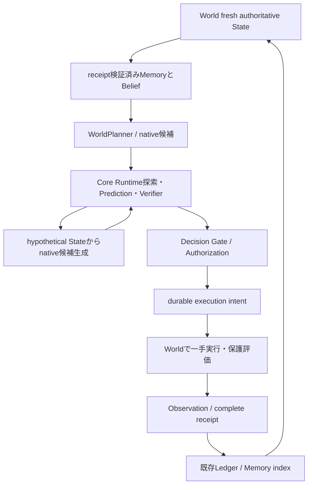

# Software Cognitive Runtime

2026-10-09。公開main `c7f67d86`（PR #6 merge後）から独立して実装。
PR #6はGitHubでMERGEDを確認し、本スプリントでmerge操作はしていない。
元workspaceの未コミット変更・研究原文・private履歴は公開変更に含めない。

## 監査と責務

| 層 | 既存の責務 | 今回の接続 |
| --- | --- | --- |
| World Protocol | Task、観測、候補生成、検証、receipt付き実行、完了判定 | 同じProtocolを維持 |
| Software / Program World | 許可済みpatch、仮想materialize、隔離temporary directoryでの保護Python評価 | 観測・候補・receiptの入れ子共有を防ぐ |
| FutureEngine / Registry | 宣言済み予測・検証、資格・相関・identity・lineage検査 | LocalHeuristic / LocalVerifierをそのまま使う |
| Core Runtime / Gate | 探索、fresh observation、検証、承認、durable intent、一手実行、receipt、校正 | 一切変更しない |
| Ledger / EpisodicMemory | 確定receiptに一致する実経験、更新token、再構築可能index | 既存実装を再利用。独立authorityは作らない |
| CognitiveAgent / Belief | 観測と推定の分離、記憶、外部Goal、roundごとの一手 | native探索とasync候補生成を接続 |
| API / CLI | FastAPIのrun/tree/event、既存demo・benchmark | HTTP契約は変更せず、local `cognitive-demo`だけ追加 |

従来Agentは `Policy.search=True` を拒否し、hypothetical Stateに対する候補生成を
扱えなかった。Software修正の準備→適用という仮想pathを評価する既存Coreを
利用するため、明示的な `propose_hypothetical` 対応Plannerのみ探索を許可する。
queue向け同期Plannerと従来のround予算はそのまま動く。

## 公開インターフェースとデータフロー

`preact.cognition` から `CognitiveAgent`, `WorldPlanner`, `CandidateGenerator`,
`Belief`, `Goal`, `EpisodicMemory` を利用できる。CognitivePlannerの `infer` は
同期、`propose` は同期またはawaitable。Coreにdomain依存を追加しない。

```python
from preact.cognition import CognitiveAgent, Goal, WorldPlanner
from preact.core.models import Policy
from preact.core.registry import Registry
from preact.core.store import Artifacts, Store
from preact.domains.software import SoftwareWorld
from preact.engines.local import LocalHeuristic, LocalVerifier

async def repair():
    world = SoftwareWorld(seed=11)
    planner = WorldPlanner(world)  # candidate_generator=your_generator で差し替え可
    agent = CognitiveAgent(
        Store("sqlite:///.cache/my-software-episode/ledger.db"),
        Artifacts(".cache/my-software-episode/artifacts"),
        Registry([LocalHeuristic(world), LocalVerifier(world)]),
        planner,
        [Goal(name="Repair checkout", metric="goal_progress", target=1)],
        Policy(search=True, max_calls=24),
        episode_budget=True,
    )
    return await agent.run(world, max_rounds=4)
```

World、候補生成器、Prediction/Verification Engine、Policyは呼出し元が設定する。
WorldPlannerはnativeの `async propose(state, width)` を使う。外部計算を行う
候補生成器にはWorldと同じ `proposal_calls`, `usage`, `proposal_usage_complete`
契約が必要で、認知wrapperがそれらをCoreへ転送する。予算不足なら呼出し前に拒否。
別のGoal最適化が必要ならCognitivePlannerを実装する。WorldPlannerのGoalは進捗表示用で、
task semanticsを上書きしない。候補poolを勝手に増やさず、nativeのwidthを尊重する。



仮想StateはBeliefやMemoryへ入らない。開始時・実行直前・実行後・round間・最終の
実観測を省略しない。Belief.observedは今回のStateで、候補・Gate・authorizationは
キャッシュしない。WorldPlannerはBelief Reuseにopt-inしない。

## 最小の記憶利用

同じdomain、入力Stateのidとpayload、provenanceについて、確定済み実行が
目標未達だった回数をActionのkind/payload/duration別に数える。run/seqの出所を
Inferenceに残し、同じ候補pool内でその再試行を後順位にする。
候補は削除せず、仮想枝の検証結果を失敗経験として数えない。
これはsoftなretry heuristicで、確率推定・安全性証明ではない。
標準Softwareタスクでは通常stateが進むのでこのheuristicは発動しない。
本実測で「Memoryにより修正能力が向上した」とは主張できない。

## 安全性と予算

- AgentはPolicy入力をsnapshot化し、公開 `agent.policy` はdefensive copyを返す。
  設定変更は新Agentの構築時に行う。Plannerによる公開Policyの緩和はRuntimeへ反映されない。
- `episode_budget=True` はcalls（engine+proposer）、費用、経過時間の残量を次roundへ渡す。
  source Task.max_stepsもepisodeの行動上限とする。未知費用なら次roundを止める。
  depth/width/max_nodesは既存Runtimeと同じく各searchの制限。
- legacy queueはTask.max_steps=1をround仕様として使うため、既定値は従来のround予算。
  Software例とCLIはepisode予算を明示する。途中のRuntime `failed_task` は一手では
  全体目標未達という意味で、Agentは次roundで継続できる。
- WorldのTask変化、候補生成による入力変更、stale State、推定失敗はfail-closed。
  Runtimeの直前再観測・Gate再確認・intent後の承認再確認・receipt確定を変更しない。
- SoftwareWorldのobserve/materializeと両Worldのreceipt返却はdeep copy。
  Software probeのキャンセル時には子processをkillしてwaitする。
- 実行は既存列挙済みfirst-party sourceだけをtemporary directory / Python `-I` で評価。
  OS container隔離ではない。任意シェルや生成コードのホスト実行は追加しない。

Agentは一episode専用で、例外・キャンセル後も再使用を拒否する。pending intentは
保持し、自動再試行しない。再起動時の物理的な副作用照合は呼出し元の責務。
Store.recoverと新Agentは未確定実行を成功へ変えない。Memory復元は公開manifestの
run_idsについて `remember` を呼び、必ずreceiptを再検証する。これを新episodeへ
暗黙転用しない。StoreとWorldが独立processで並行変更される際の限界は既存の
[Memory境界](episodic-memory-index.md)に従う。これは外部変更をロックする仕組みではない。
Python内のpluginは信頼されたコードであり、private属性へ直接侵入する悪意あるコードを
隔離するsandboxではない。Policy・Task・Worldの実行許可はホスト側が管理する。

## 実行と次の課題

```sh
uv run preact cognitive-demo --seed 11 --max-rounds 4
uv run preact cognitive-demo --flat --no-memory
uv run python -m scripts.bench_software_cognition \
  --output .cache/new-software-study --report .cache/new-software-results.json
uv run python -m scripts.audit_software_cognition \
  --report .cache/new-software-results.json --raw .cache/new-software-study
```

CLIは既存local Software adapterだけを使い、`PREACT_MODE`で生成コード実行へ切り替えない。
既存 `demo`, API, frontend契約、queue v1/v2、凍結済みprotocol/resultは変更しない。
比較と限界は[実測文書](software-cognition-results.md)を参照。
次は、Memoryが意味を持つ実用的な反復修正taskと、実行失敗後の照合・安全な再開の
明示的なホストAPIを優先する。LLM・Vector DB・神経World Modelの追加は未着手。
